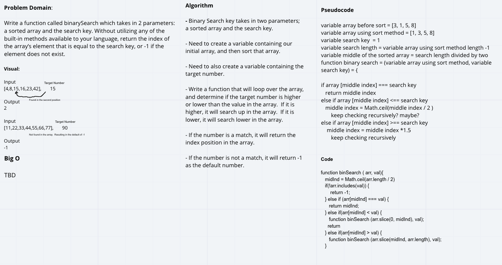

# Challenge Summary
Write a function called BinarySearch which takes in 2 parameters: a sorted array and the search key. Without utilizing any of the built-in methods available to your language, return the index of the array’s element that is equal to the search key, or -1 if the element does not exist.

## Challenge Description
Create a function that searches the array for an index position without going in sequential order.   

## Approach & Efficiency
The thought was to use a recursive function to constantly call the function while it does the work.  First, checking if the key value is the middle of the array, the first thing that we are checking for.  If the key isn't in the middle, we then figure out if the number is either higher, or lower than the middle point of the array.  We slice off the rest of the array and keep repeating the function. Finding the middle point, slicing off the remainder, and moving on.  Ultimately, we be left with the middle point of the array. 

## Solution

## Co-Author 
 - Matthew Herriges