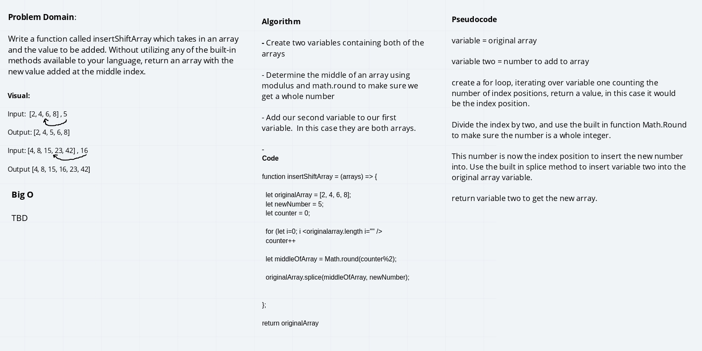

# Challenge Summary
Insert and shift an array in middle at index

## Challenge Description
Need to create a function that can add values to the middle of the array. 

## Approach & Efficiency
My approach was originally to use a sort method since the numbers were nicel going in ascending order.  I was also faced witht he problem of having to account for the fact that we were using an odd number of index positions for the array as well.   My approach was to count the number of index positions using a for loop.  This would give me the total number of positions for each array.  I can then use that number and divide it by 2, giving me two halves of the array.  This would fluctuate whether or not the array had even or odd index positions.  I can then take the result from the counter being divided by two, to then use that as the index position I would need to splice my new number into, subtracting one, as an array index starting position starts at zero.  I'm not entirely sure if this is the most efficient way to make this happen as there are three variables and three different processes, however this is the solution that I came up with. 

## Solution
