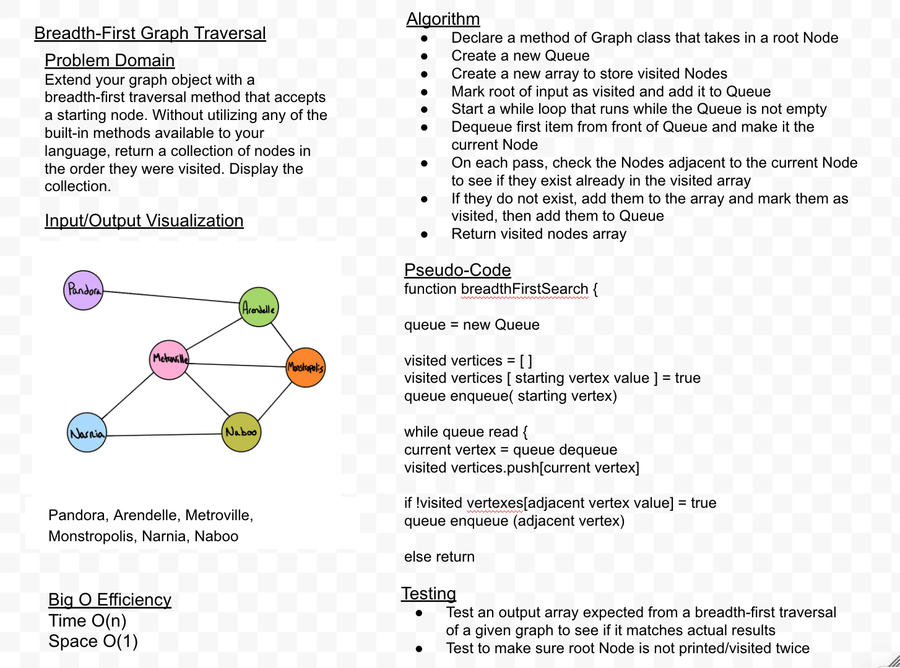

# Challenge Summary
Extend your graph object with a breadth-first traversal method that accepts a starting node. Without utilizing any of the built-in methods available to your language, return a collection of nodes in the order they were visited. Display the collection.

   
## Approach & Efficiency
Declare a method of Graph class that takes in a root Node
Create a new Queue
Create a new array to store visited Nodes
Mark root of input as visited and add it to Queue
Start a while loop that runs while the Queue is not empty
Dequeue first item from front of Queue and make it the current Node
On each pass, check the Nodes adjacent to the current Node to see if they exist already in the visited array
If they do not exist, add them to the array and mark them as visited, then add them to Queue
Return visited nodes array

## Big O
Time - O(n)
Space - O(1)

## Solution

## Co-Author 
 - Alex Whan