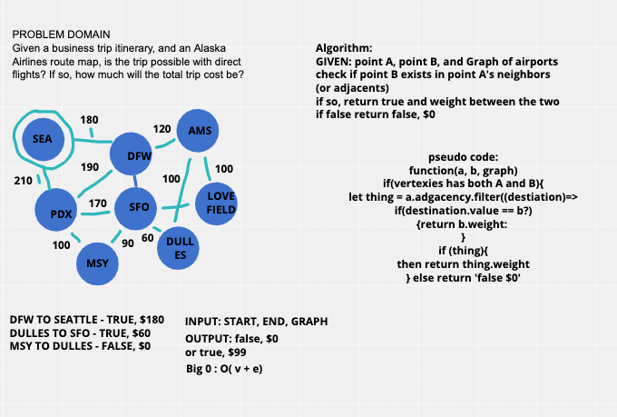

# Challenge Summary
GIVEN: point A, point B, and Graph of airports
check if point B exists in point A's neighbors (or adjacents)
if so, return true and weight between the two
if false return false, $0

 ## Approach
After further resflection, I realized that my whiteboard wasn't initially correct, and I will rewrite the correct algorithim below.  This was an example taken from the Common Sense Data and Algorithims Book.

1. We visit the starting city, making it our "current city"
1. We check the prices from the current city to each of its adjacent cities. 
1. If the price to an adjacent city from the starting city is cheaper than tha price currently in cheapest prices table ( or tha adjacent city isn't yet in the cheapest prices at all)
  a. We update the cheapest prices table to reflect this cheaper price. 
  b. We update the cheapest previous stop over city table making the adjacent city the key and the current city the value. 
1. We then visit whichever unvisited city has the cheapest price from the starting city, making it the current city. 
5. We repeat steps 2 through 4 until we've visited every known city. 

 ##  Efficiency
Big 0: O(v+e)

## Solution

## Co-Author 
- Beasley