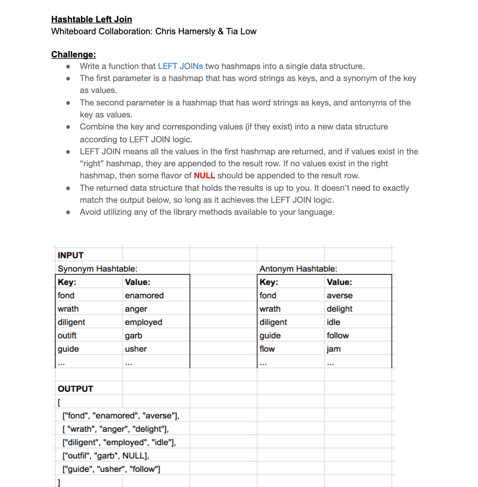
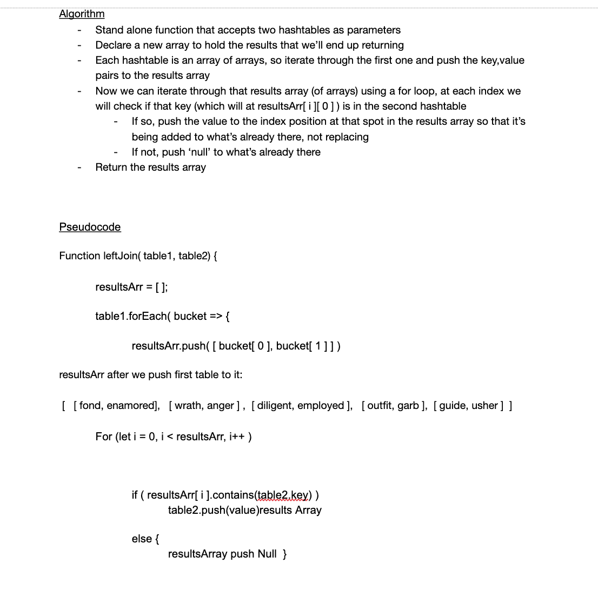
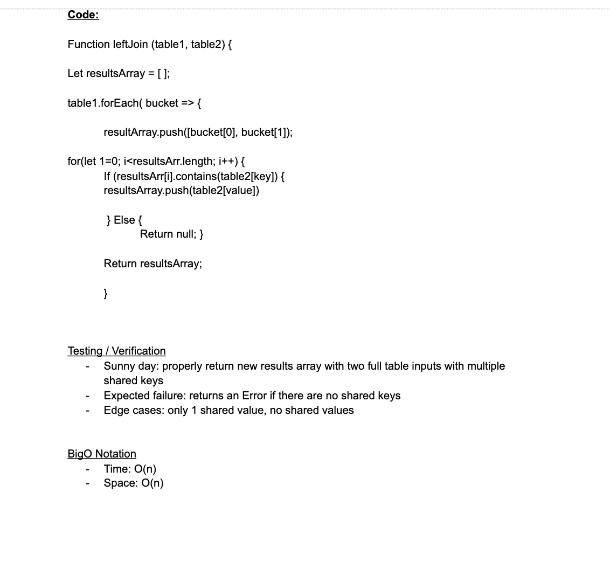

# Challenge Summary
Write a function that LEFT JOINs two hashmaps into a single data structure.
The first parameter is a hashmap that has word strings as keys, and a synonym of the key as values.
The second parameter is a hashmap that has word strings as keys, and antonyms of the key as values.
Combine the key and corresponding values (if they exist) into a new data structure according to LEFT JOIN logic.
LEFT JOIN means all the values in the first hashmap are returned, and if values exist in the “right” hashmap, they are appended to the result row. If no values exist in the right hashmap, then some flavor of NULL should be appended to the result row.
The returned data structure that holds the results is up to you. It doesn’t need to exactly match the output below, so long as it achieves the LEFT JOIN logic.
Avoid utilizing any of the library methods available to your language.

 ## Approach
  1. Stand alone function that accepts two hashtables as parameters
  1. Declare a new array to hold the results that we’ll end up returning
  1. Each hashtable is an array of arrays, so iterate through the first one and push the key,value pairs to the results array
  1. Now we can iterate through that results array (of arrays) using a for loop, at each index we will check if that key (which will at resultsArr[ i ][ 0 ] ) is in the second hashtable 
  1. If so, push the value to the index position at that spot in the results array so that it’s being added to what’s already there, not replacing
  1. If not, push ‘null’ to what’s already there
  Return the results array

 ##  Efficiency

  1. Time: O(n)
  1. Space: O(n)

## Solution

## Co-Author 
 - Tia Low 