# Merge Sort

1. For the merge sort method we are going to use the following array;
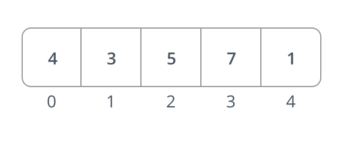

1. We start by splitting the entire array in half(or as close to it as we can)
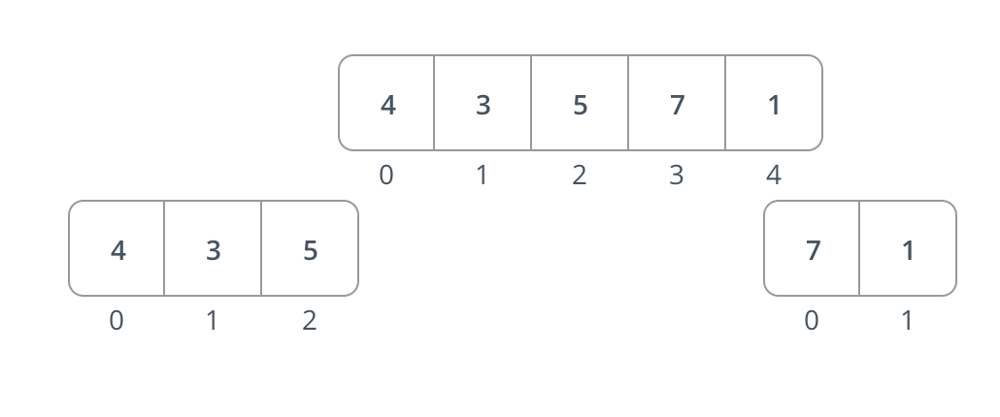

1. Now we are going to select the left side of the subarray.
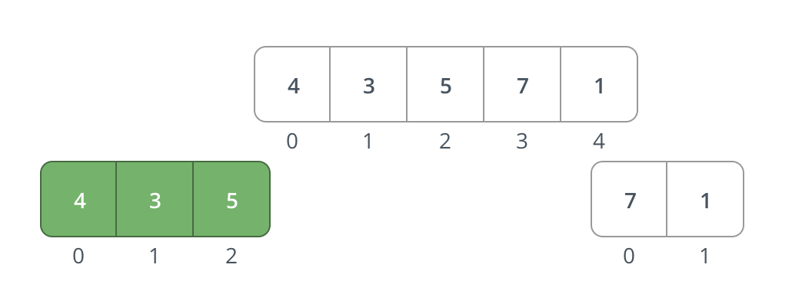

1. Repeat the same method as before by splitting the array into two again.
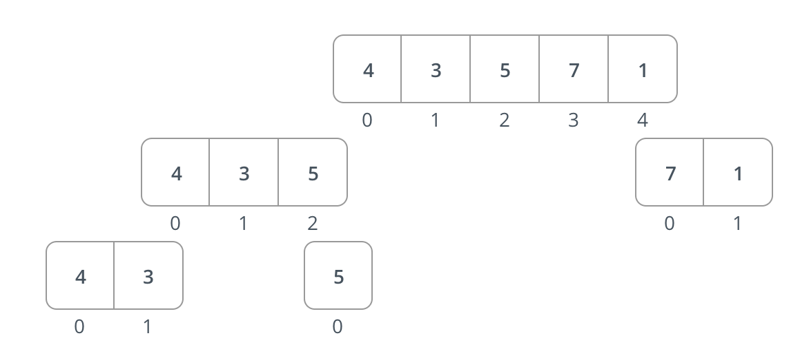

1. Select the left side of this subarray
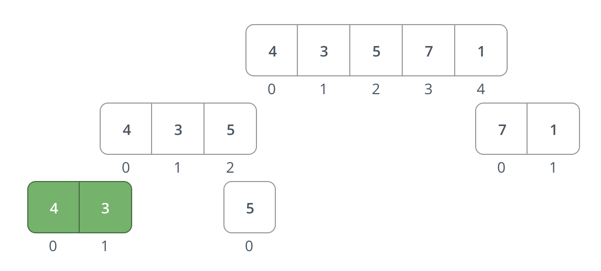
1. Split this array in half
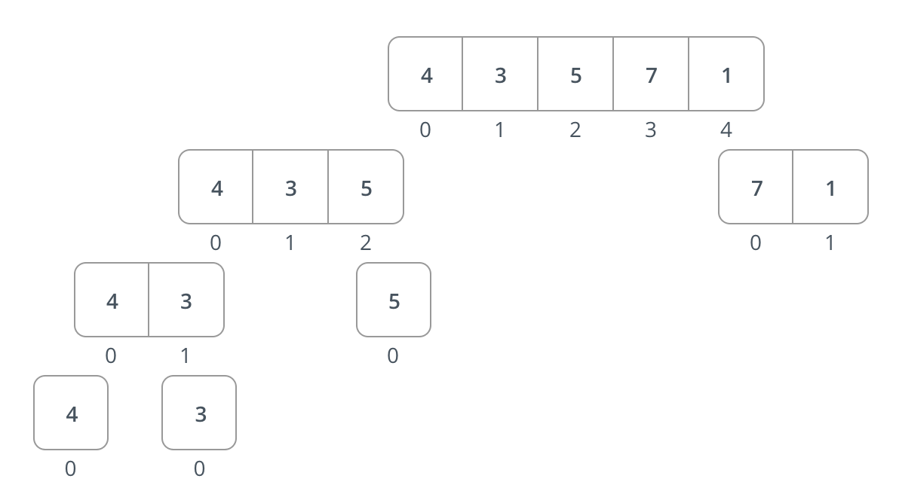
1. Now, we can compare the two values in the two different arrays. 
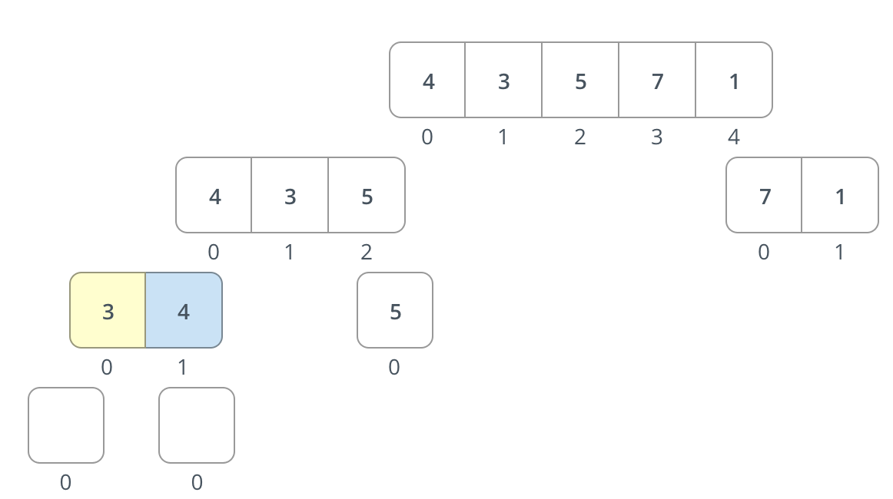
1. If the left side is less than the right side, push the value into the placeholder for the left side of the old array. 
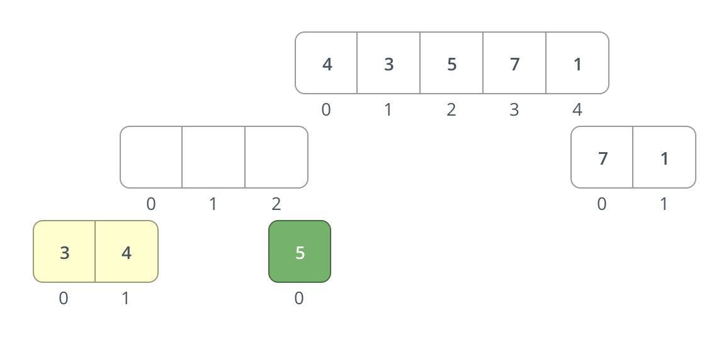
1. Return the temporary numbers in the array.
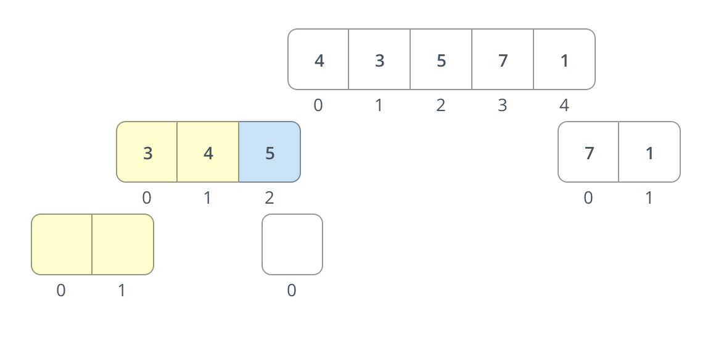
1. Now that the left side is done, move onto the right side of the array. 
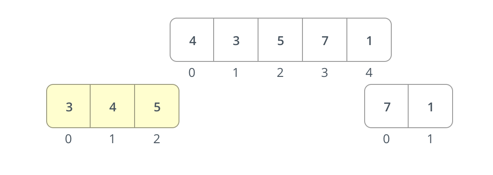
1. Split the left side of the array 
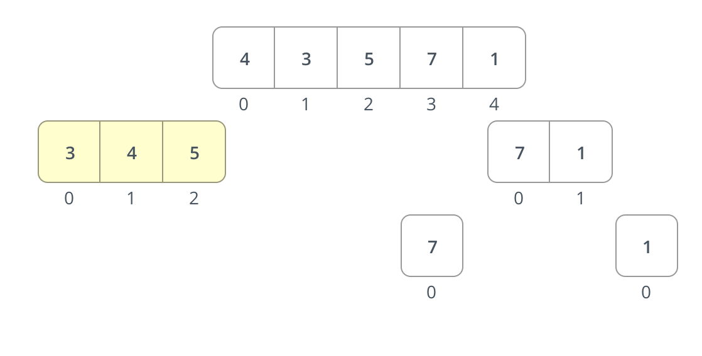
1. Evaluate the values in the right side of the array. 
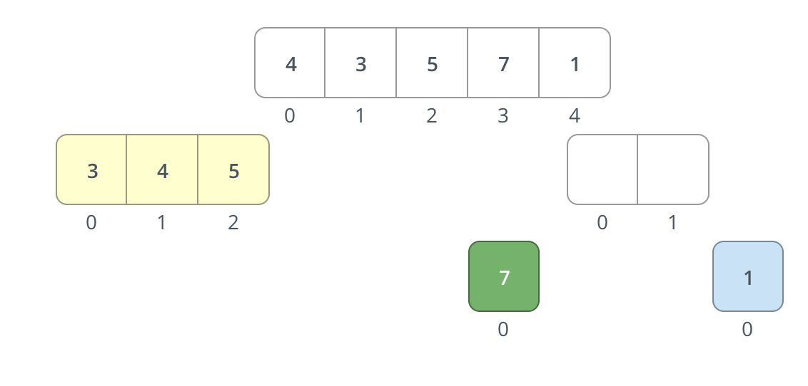
1. Push the lower value into the array, followed by the second. 
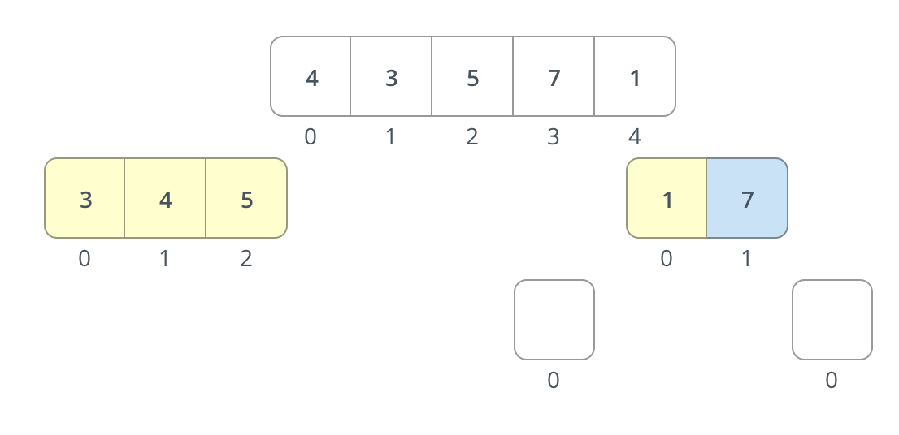
1. Now, compare the left values and the right values and push the values into the original array.
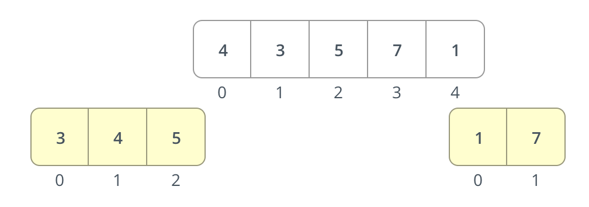
1. Push the lower values into the arrays 
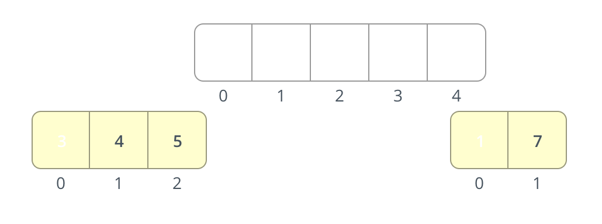
1. Return the original array, and the we are sorted. 
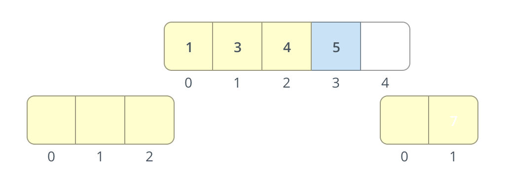

> That was easy enough!!
