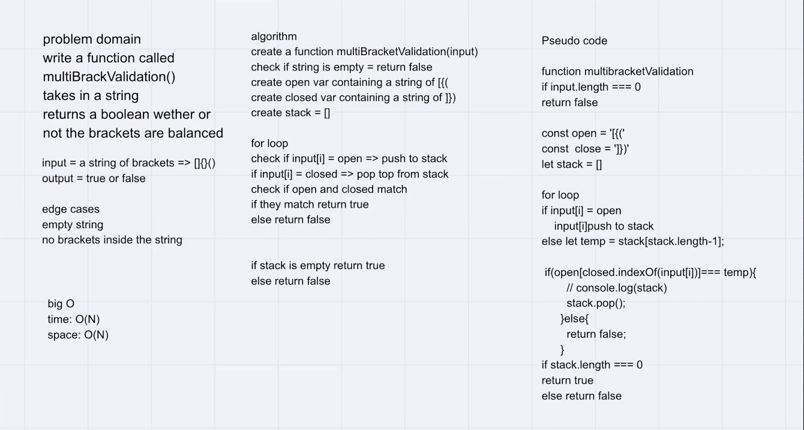

# Challenge Summary
Your function should take a string as its only argument, and should return a boolean representing whether or not the brackets in the string are balanced. There are 3 types of brackets:

Round Brackets : ()
Square Brackets : []
Curly Brackets : {}

## Challenge Description

## Approach & Efficiency
We wanted to loop over the array, and utilize a stack as our storage.  While we are looping over the string, we wanted to pop off opening brackets, and comparing them to the closing brackets in the array.  Once they are compared, if they match, they return to the loop and keep going through the string.  While we are done with our loop, once the string is completely empty with all of the matches being made, we will return true. 

Efficiency is O(n);

## Solution

## Co-Author(s)

 - Lulu Sevignon