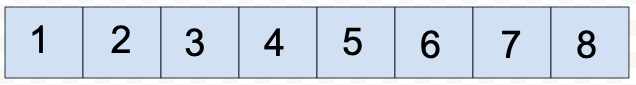
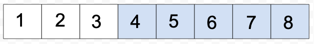
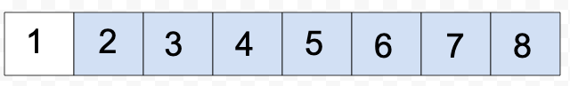
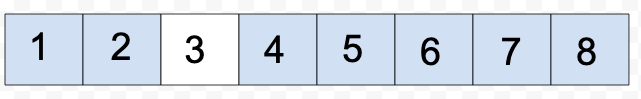
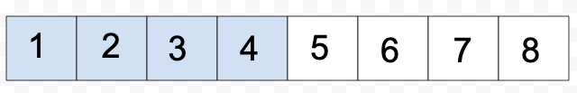
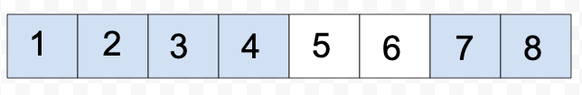
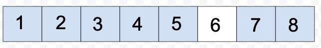
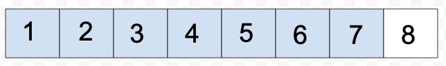

# Quick Sort

> This method uses a combination of partitioning recursion to make sort the array.  This example below, has the numbers sorted below, but it is showing the partitioning method and switching the numbers if its necessary. 

1. We are defining the initial array, and getting the size of the array. 

1. Next step is to partition the array into a smaller array.  In this smaller array, we now sort the smaller array by swapping the numbers around.  

1. Now we start to arrange the array, from the smallest to the largest. 

1. Again, we are doing all of these functions by calling them recursively.  This is still moving through the array and sorting the numbers as we move along. 

1. Now we are moving to the right subarray and will step through and evaluate all of the numbers in the subarray. 

1. Still splitting the subarray and evaluating the numbers by calling them recursively. 

1. Still moving through the array and now placing the numbers in the array after they are evaluated.

1. Evaluating the last number and finalizing the array. 

1. Now we return the array.  
