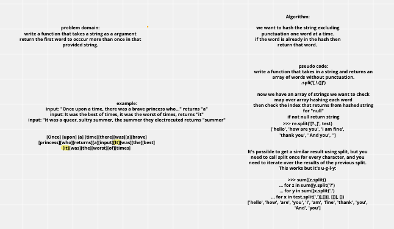

# Challenge Summary
Write a function that accepts a lengthy string parameter.
Without utilizing any of the built-in library methods available to your language, return the first word to occur more than once in that provided string.

## Challenge Description
   

## Approach & Efficiency
We decided to put values into the hashtable, and check for collisions.  When the first collision occurs, we will return that key or index, as they are the same.  That will get us the first match in string.  

## Solution

## Co-Author 
 - Jon Beasley