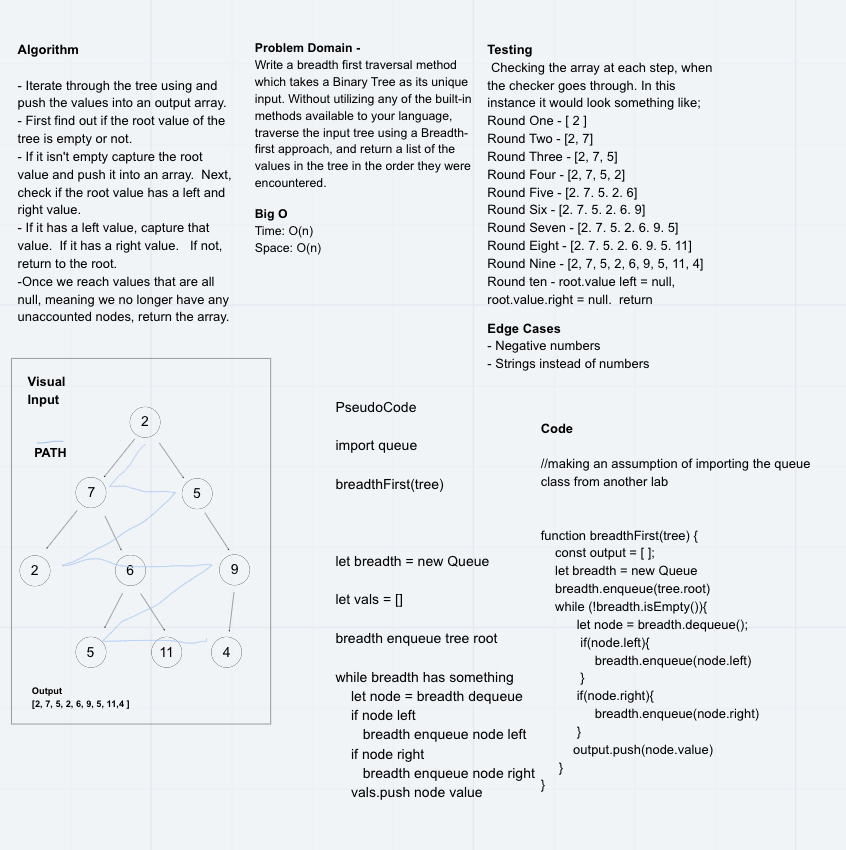

# Challenge Summary
Write a breadth first traversal method which takes a Binary Tree as its unique input. Without utilizing any of the built-in methods available to your language, traverse the input tree using a Breadth-first approach, and return a list of the values in the tree in the order they were encountered.

## Challenge Description

## Approach & Efficiency
We decided to traverse the tree by taking in the first value and adding it to a queue.  Then we queued up the left and right values onto the queue and moved down.  Once we moved we deque the front of the queue and move on to the tree, repeating until we reach a null value for the left and right value and return the values into an array. 

Efficiency is O(n);

## Solution

## Co-Author(s)
 - Matthew Herriges