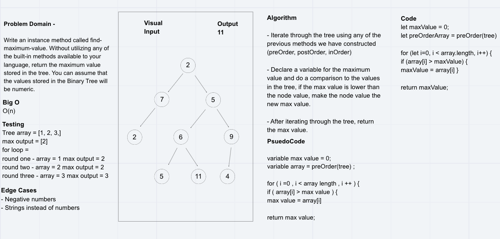

# Challenge Summary
Write an instance method called find-maximum-value. Without utilizing any of the built-in methods available to your language, return the maximum value stored in the tree. You can assume that the values stored in the Binary Tree will be numeric.

## Challenge Description

## Approach & Efficiency
For this challenge we decided to use the previous method we created to be able to iterate over our return array from preOrder.  Using a for loop, we are iterating over the return array, and comparing two values, letting the original max array = 0.  If the number that the array is looping over is greater than the number of the max value number, we reassign the number, and move on to the next position in the array.  After we have gone through the length of the array, we return the max number.  

Efficiency is O(n);

## Solution

## Co-Author(s)
 - Sean Murray