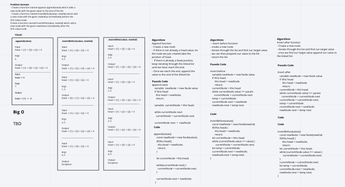
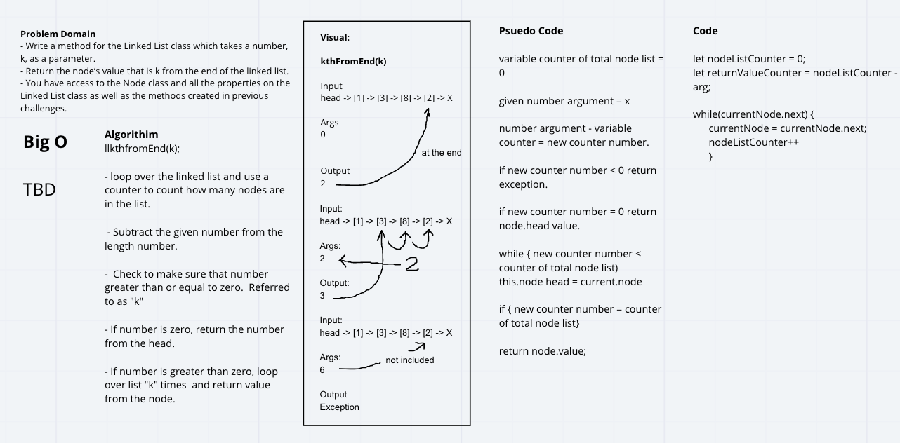

# Singly Linked List
 - A linked list is a linear data structure similar to an array. However, unlike arrays, elements are not stored in a particular memory location or index. Rather each element is a separate object that contains a pointer or a link to the next object in that list.

 - In this instance I'm creating algorithims to help traverse throughout the linked list.

## Challenge
 - Define a method called insert which takes any value as an argument and adds a new node with that value to the head of the list with an O(1) Time performance.
- Define a method called includes which takes any value as an argument and returns a boolean result depending on whether that value exists as a Node’s value somewhere within the list.
- Define a method called toString (or __str__ in Python) which takes in no arguments and returns a string representing all the values in the Linked List, formatted as:
"{ a } -> { b } -> { c } -> NULL"

## Approach & Efficiency
For Include, I first needed to establish a while loop letting the alogirithim run if certain parameters were met. In this case, if there was a next node.  I then decided to use an if conditional to deliver the results necessary.  If it has a value, return true.  If it doesn't return false. 

For toString I thought it would also be easy to use a while loop.  Going through the node and storing the values of the linked list in a variable called string.  As its moving through the link list it is taking the values from each node and pushing them into an empty string, and then returning the string at the end of the while loop. 

For includes before and after, we needed to determine our target for the linked list.  Once we find the target for our linked list, we then insert the argument either before or after the target value. 

Find value of K - Our approach was to first use a counter to go through the linked list.  We would return a value from the counter and subtract that from the argument we are given as our k.  If our counter number and k equalled less than zero, we would then return an exception.  If not, we would loop over the list the amount of times we calculated earlier and return the value from the node when the counter equalled zero. 

## API

## Solution

## Co-Author(s): 
 - Matthew Herriges
 - Jen Chinzi

 Big O in the last solution k from the end is )
